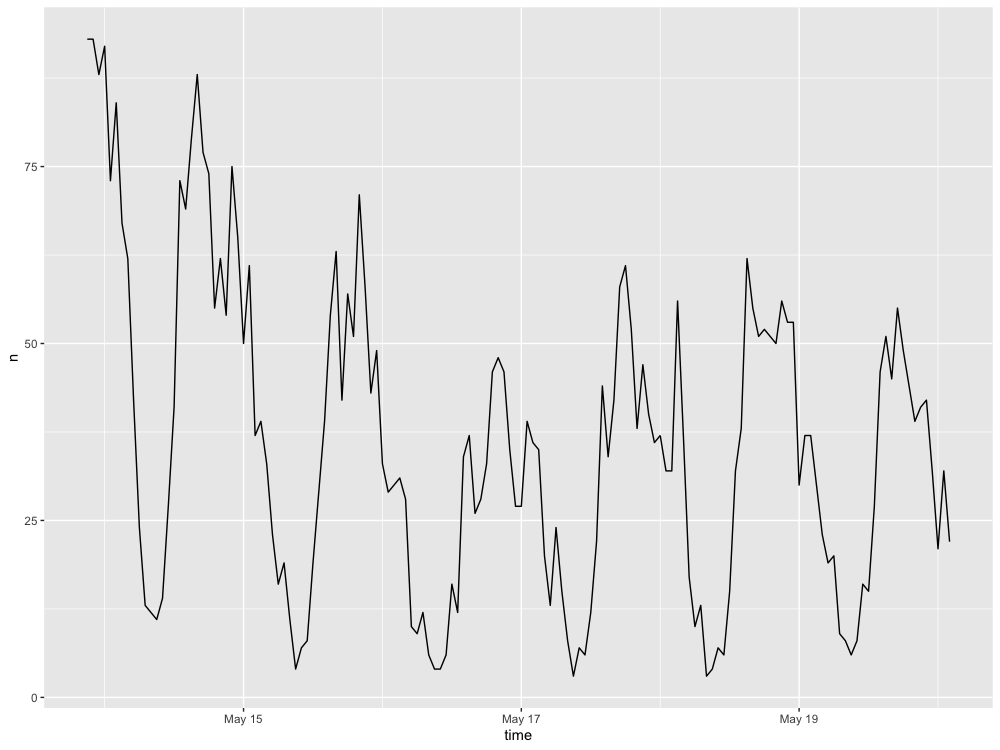
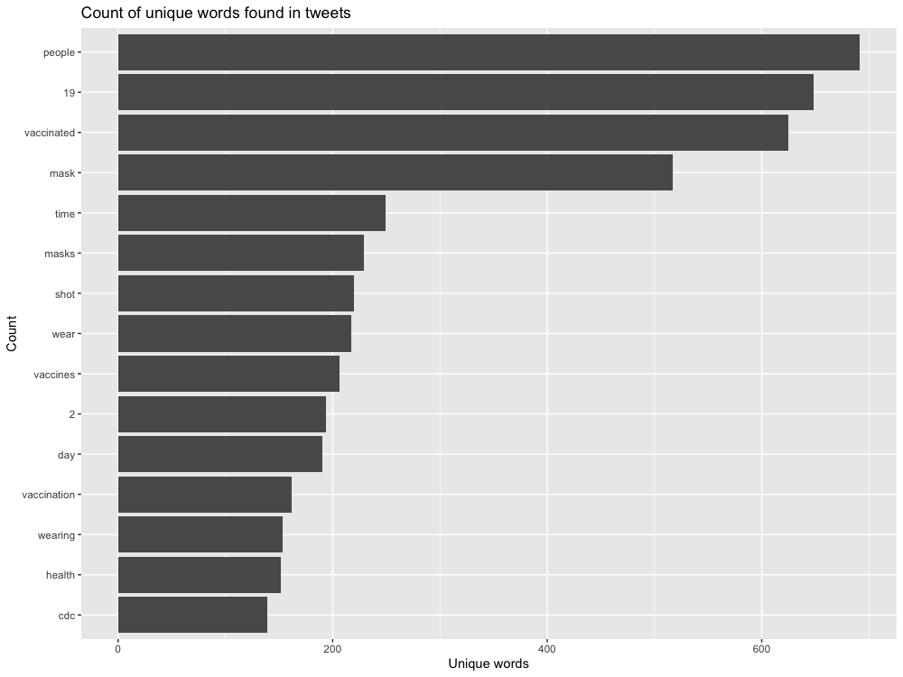
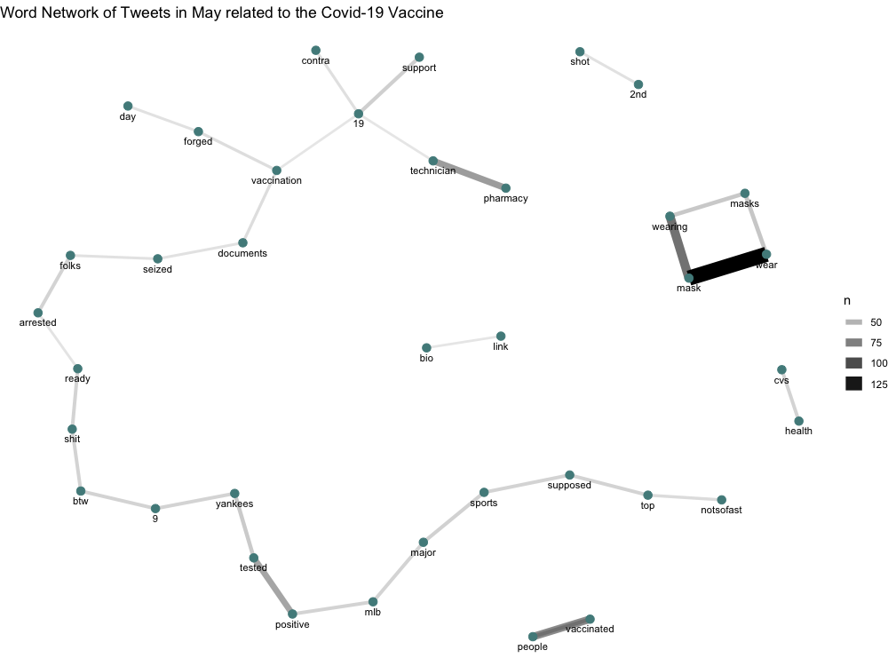
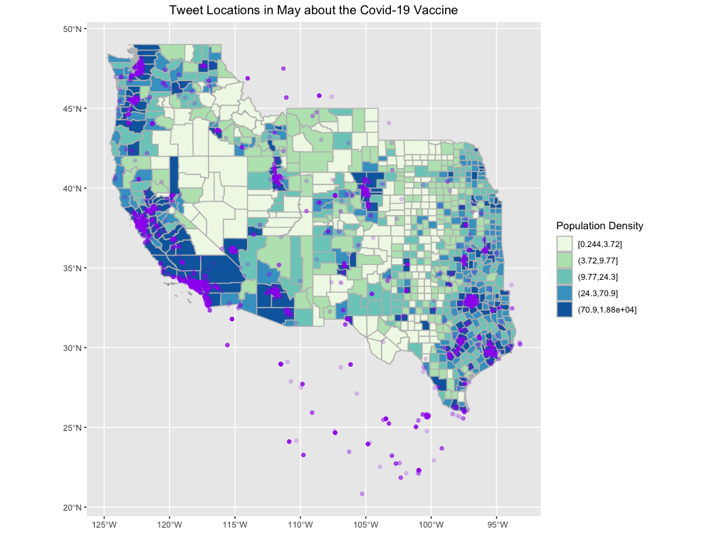
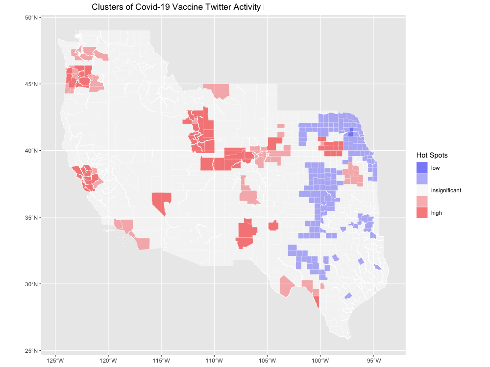

**Replication of**
# Spatial, temporal and content analysis of Twitter data

Original study *by* Wang, Z., X. Ye, and M. H. Tsou. 2016. Spatial, temporal, and content analysis of Twitter for wildfire hazards. *Natural Hazards* 83 (1):523–540. DOI:[10.1007/s11069-016-2329-6](https://doi.org/10.1007/s11069-016-2329-6).
and
First replication study by Holler, J. 2021 (in preparation). Hurricane Dorian vs Sharpie Pen: an empirical test of social amplification of risk on social media.

Replication Author:
Alitzel Villanueva

Replication Materials Available at: [RE-Dorian](https://github.com/avillanueva1005/RE-Dorian)

Created: `19 May 2021`
Revised: `24 May 2021`

## Abstract

The spatial distribution of Twitter data is useful to better understand natural disaster management from a human perspective, as Wang et al. (2016) and Holler (2021) have studied. It is difficult and not cost effective, in terms of time or money, to conduct human-oriented studies to analyze human behavior in natural disasters, despite how useful this data could be used to more effectively prepare and mitigate natural disaster effects. The use of social media information like Twitter posts that were generated during a natural disaster can solve this issue because of its accessibility and applicability to analyze what resources and needed where during any disaster event.

Wang et al. (2016) analyzed Twitter data for wildfires in California, finding that the social media data can provide useful information about natural disasters like wildfires through their ability to represent wildfires over space and time. Additionally, Wang et al. found that during natural disasters like wildfires, people's geographic awareness is distinct and they focus on broadcasting wildfire damage. Traditional forms of media and other public spokespeople hold a lot of social capital on sites like Twitter and they are integral to the retweet network surrounding a disaster during one.

Holler (2021) is studying Twitter data for Hurricane Dorian on the Atlantic coast, finding that in spite of trending news and social media content regarding a false narrative of risk, original Tweets still clustered significantly along the real hurricane track, and only along the hurricane track. Reproducing and replicating spatial research of Wang et al. and Holler continues to be relevant because of its accessibility and usefulness to supplement natural disaster preparation and responses. Furthermore, the use of social media data to conduct spatial research also can be helpful in further understanding other important emergency/current events to respond to additional community needs such as Covid-19 vaccine distribution. The use of social media in these kinds of events can benefit local and federal vaccine roll outs, for example, as people's attitudes and needs are publicized online.

In his replication study, I will examine Twitter activity around the Los Angeles area, specifically looking at Covid-19 vaccine posts from May 14-20, 2021.

## Original Study Information

Holler (2021) loosely replicated the methods of Wang et al (2016) for the case of Hurricane Dorian's landfall on the U.S. mainland during the 2019 Atlantic Hurricane season. Data was based on Twitter Search API queries for "fire" and "wildfire".

Holler modified Wang et al's methods by not searching for retweets for network analysis, focusing instead on original Tweet content with keywords hurricane, Dorian, or sharpiegate (a trending hashtag referring to the storm). Holler modified the methodology for normalizing tweet data by creating a normalized Tweet difference index and extended the methodology to test for spatial clustering with the local Getis-Ord statistic. The study tested a hypothesis that false narratives of hurricane risk promulgated at the highest levels of the United States government would significantly distort the geographic distribution of Twitter activity related to the hurricane and its impacts, finding that original Twitter data still clustered only in the affected areas of the Atlantic coast in spite of false narratives about risk of a westward track through Alabama.

Wang et al (2016) conducted their study using the `tm` and `igraph` packages in `R 3.1.2`. Is it known what GIS software was used for spatial analysis?
The replication study by Holler (2021) and my replication study used R, including the rtweet, rehydratoR, igraph, sf, and spdep packages for analysis.

## Materials and Procedure

My methodology followed the procedure used by Holler (2021) with the exception that I modified the Twitter Search API queries to be "covid", "coronavirus", and "vaccine". The dates used were also different from Holler (2021) because I conducted this query on May 20th and therefore the data used for this replication study ranged from May 14th to May 20th 2021. Additionally, I focussed my replication study on the Greater Los Angeles area (31N,-118W) with a 1000 mile radius. From this query, I collected data for nearly the entire western half of the United States and part of northern Mexico, however the Mexican tweets were not included in the spatial cluster analysis because county population data from the U.S. Census was used to normalize the Twitter data. I also collected all Twitter data from the same time period with the same geographic range to calculate a normalized difference index.

The raw data was cleaned, geographic location was converted in latitude and longitude coordinates, and the Twitter status ids for the [Covid-19 vaccine search](RE-Dorian/public/covidids.txt) as well for the [general May search](RE-Dorian/public/mayids.txt) were saved. This filtered Twitter data was analyzed to examine the number of Covid-19 vaccine related tweets over the data collection period from May 14-20, 2021 (Figure 1), the frequency of the most common words used in the Covid-19 vaccine Twitter API search (Figure 2), and also the words most frequently associated with each other in a word pair network (Figure 3). This data was then spatially joined to the county population data from the U.S. Census to locate tweets related to the Covid-19 vaccine in comparison to population density (Figure 4). Additionally, normalized tweet rates were calculated per 10000 people by county to find hot and cold clusters of Twitter activity during the study period (Figure 5) using code developed by [Casey Lilley](https://caseylilley.github.io/finalproj.html)(2019) and edited by Joe Holler (2021).

## Replication Results


Figure 1. Number of COVID-19 vaccine tweets from May 14th to May 20th 2021.


Figure 2. Frequency of most commonly tweeted words that appeared during this study period.


Figure 3. Word pair network of words commonly found together in tweets during this study period.


Figure 4. Tweet locations of posts related to the Covid-19 vaccine in the Western half of the U.S.


Figure 5. Hot and cold spots for Covid-19 related Twitter activity in the Western half of the U.S.

## Unplanned Deviations from the Protocol

Aside from initial changes to the Holler (2021) code on the Twitter Search API queries and geographic search location used, the workflow for the final analysis did not change from the initial code that was used to analyze Hurricane Dorian related tweets in Holler (2021). I did not complete the Hurricane Dorian spatial analysis in PostGIS, but instead calculated the normalized difference tweet index in R. However, I did not end up using this code for the final Covid-19 vaccine analysis, but instead used the final code used by Holler (2021).

```
--Count the number of dorian points in each county
counties = counties %>%
  mutate(
    doriancount = st_intersects(counties$geometry, doraingeom$geometry) %>%
  lengths(
  ))
--Count the number of november points in each county
novgeom <-st_as_sf(november, coords = c("lng","lat")) %>%
  st_set_crs(4326) %>%
  st_transform(4269)
counties = counties %>%
  mutate(
    novcount = st_intersects(counties$geometry, novgeom$geometry) %>%
      lengths(
      ))
--Set counties with no points to 0 for the november count
--Calculate the normalized difference tweet index (made this up, based on NDVI), where
--ndti = (tweets about storm – baseline Twitter activity) / (tweets about storm + baseline Twitter activity)
dorian = dorian %>%
  mutate(
    normalizeddiff = (length(dorian$text)-length(november$text))/(length(dorian$text)+length(november$text))
  )

random = dorian %>%
mutate(
  normalizeddiff = (n()-nrow(november))/(n()+nrow(november))
) %>%
  select(normalizeddiff)
```

## Discussion

Provide a summary and interpretation of your key findings in relation to your research question. Mention if findings confirm or contradict patterns observed by Wang et al (2016) or by Holler (2021)

Over time there was a steady decline in the number of Covid-19 related tweets which can be partially explained by the excitement generated by previous [expanded roll out of the Pfizer vaccine to 12-15 year olds on May 10 in the U.S.](https://www.fda.gov/news-events/press-announcements/coronavirus-covid-19-update-fda-authorizes-pfizer-biontech-covid-19-vaccine-emergency-use) (Figure 1). Holler (2021) had similar results of the highest number of tweets related to Hurricane Dorian occurring closest to the time of the event relevant to the Twitter API search query. The most frequently tweeted words were all related to the virus or vaccine, including the numbers "19" and "2", given the name of the virus, Covid-19, and the number of doses for two of the more prevalent vaccines, Moderna and Pfizer (Figure 2). In Figure 3, the unexpected connection of the Covid-19 vaccine to baseball and specifically the Yankees is due to the [nine vaccinated Yankee players and staff members that tested positive for Covid-19](https://www.cnbc.com/2021/05/18/new-york-yankees-breakthrough-covid-cases-in-vaccinated-team-members.html). Another interesting insight from the word pairing map was the strong, independent relationship between the words "wear/ing" and "mask/s", which also makes sense given the context of the relevant discourse surrounding wearing masks currently.

## Conclusion

Restate the key findings and discuss their broader societal implications or contributions to theory.
Do the research findings suggest a need for any future research?

## References

Holler, J. 2021 (in preparation). Hurricane Dorian vs Sharpie Pen: an empirical test of social amplification of risk on social media.

Wang, Z., X. Ye, and M. H. Tsou. 2016. Spatial, temporal, and content analysis of Twitter for wildfire hazards. *Natural Hazards* 83 (1):523–540. DOI:[10.1007/s11069-016-2329-6](https://doi.org/10.1007/s11069-016-2329-6).

####  Report Template References & License

This template was developed by Peter Kedron and Joseph Holler with funding support from HEGS-2049837. This template is an adaptation of the ReScience Article Template Developed by N.P Rougier, released under a GPL version 3 license and available here: https://github.com/ReScience/template. Copyright © Nicolas Rougier and coauthors. It also draws inspiration from the pre-registration protocol of the Open Science Framework and the replication studies of Camerer et al. (2016, 2018). See https://osf.io/pfdyw/ and https://osf.io/bzm54/

Camerer, C. F., A. Dreber, E. Forsell, T.-H. Ho, J. Huber, M. Johannesson, M. Kirchler, J. Almenberg, A. Altmejd, T. Chan, E. Heikensten, F. Holzmeister, T. Imai, S. Isaksson, G. Nave, T. Pfeiffer, M. Razen, and H. Wu. 2016. Evaluating replicability of laboratory experiments in economics. Science 351 (6280):1433–1436. https://www.sciencemag.org/lookup/doi/10.1126/science.aaf0918.

Camerer, C. F., A. Dreber, F. Holzmeister, T.-H. Ho, J. Huber, M. Johannesson, M. Kirchler, G. Nave, B. A. Nosek, T. Pfeiffer, A. Altmejd, N. Buttrick, T. Chan, Y. Chen, E. Forsell, A. Gampa, E. Heikensten, L. Hummer, T. Imai, S. Isaksson, D. Manfredi, J. Rose, E.-J. Wagenmakers, and H. Wu. 2018. Evaluating the replicability of social science experiments in Nature and Science between 2010 and 2015. Nature Human Behaviour 2 (9):637–644. http://www.nature.com/articles/s41562-018-0399-z.
