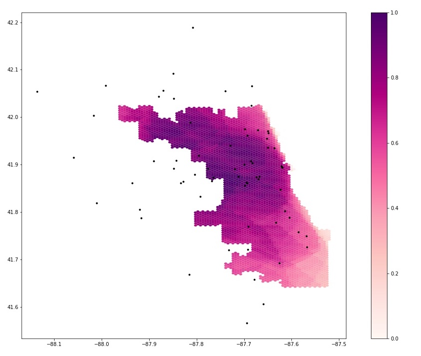

**Replication of**
# Rapidly Measuring Spatial Accessibility of COVID-19 Healthcare Resources

Original study *by* Kang, JY., Michels, A., Lyu, F. et al. Rapidly measuring spatial accessibility of COVID-19 healthcare resources: a case study of Illinois, USA. Int J Health Geogr 19, 36 (2020). https://doi.org/10.1186/s12942-020-00229-x.

Replication Author:
Alitzel Villanueva

Replication Materials Available at: [RE-Kang](https://github.com/avillanueva1005/RE-Kang)

Created: `24 May 2021`
Revised: `26 May 2021`

# Introduction

Kang et al (2020) was heavily influenced by the recent urgent need to know the spatial accessibility of healthcare resources as hundreds of thousands of people were hospitalized and died last year due to COVID-19. This study, focussed on Illinois, aimed to answer what kind of access people had to healthcare resources during the pandemic, which areas have sufficient and insufficient resources, and what role demographics play in accessibility. Kang et al measured spatial accessibility by calculating the time between homes of COVID-19 patients/vulnerable populations (people over 50 years) and health care resources creating a two-step floating catchment area using Jupyter Notebook to map the hospital and residential locations. Using an open source framework like CyberGIS-Jupyter allows others to amend the code used to create these service areas so that this spatially accessibility model can be applied to other regions of the world to address this issue of universal access that is prevalent as COVID-19 continue to persist.

# Materials and Methods

This replication study of Kang et al. followed their original  methodology almost completely with a couple of changes made to the code to improve its applicability to Illinois' spatial accessibility. Kang et al used four different datasets to understand spatially accessibility of healthcare resources for the general population and COVID-19 patients in Illinois. The [Illinois Department of Public Health (IDPH)](https://coronavirus.illinois.gov/s/medical-providers-and-facilities) provided the COVID-19 confirmed case and the hospital dataset, [U.S. Census Bureau](https://data.census.gov/cedsci/deeplinks?url=https%3A%2F%2Ffactfinder.census.gov%2F&tid=GOVSTIMESERIES.CG00ORG01) provided the residential dataset and the road network dataset was accessed through a Python package OSMnx to analyze street networks from [OpenStreetMap Python Library](https://github.com/gboeing/osmnx). Kang et al excluded all hospitals that may not serve COVID-19 patients like military, children, psychiatric, and rehabilitation hospitals. They focussed on hospitals serving the Chicago population due to the significant clustering of COVID-19 cases in the city, including hospitals within 15 miles of the Chicago boundary. They were able to use the U.S. Census data to extract data from the population over the age 50 as their vulnerable population in addition to the population that tested positive for COVID-19. Using the conventional two-step floating catchment area (2SFCA) method, Kang et al located the vulnerable population in the catchment area of each hospital and then used that to find the ratio of ICU beds/ventilators to number of vulnerable people in each catchment area. These ratios were added together for residential locations where hospital catchment areas overlapped. These accessibility measurements were then aggregated into hexagon grids.

The first major change made to the code was done to fix the error caused by OSM nodes created for the hospitals near the edges of the Chicago boundary (within 15 miles). This error caused for some areas to account for more beds or ventilators than were actually available due to the nodes' limitation of the OSM network that allowed for some hospitals to appear nearer than reality. We amended this by extending the road network by 30km so that the nodes would better represent hospital locations. I also added the code ```%time%``` to the beginning of each code block to investigate how time efficient the code was as well as change the color ramp of the final map from OrRd to RdPu so that darker reds no longer indicated more accessibility

# Results and Discussion
include images of findings (maps, graphs) and link to your final repository for the reproduction. Discuss what you learned from the reproduction attempt, especially any knowledge, insight, or uncertainty that was encoded in the repository or discovered in the reproduction but not explained in the published paper.




# Conclusions
with emphasis on the significance of the reproduction study you just completed. Was the study reproducible, and has the reproduction study increased, decreased, or otherwise refined your belief in the validity of the original study? Conclude with any insights, priorities, or questions for future research.

# Acknowledgments
Thank you to Maja Cannavo, Sanjana Roy, and the Open Source GIScience class for all of the collaborative work to modify the code.

# References

Kang, JY., Michels, A., Lyu, F. et al. Rapidly measuring spatial accessibility of COVID-19 healthcare resources: a case study of Illinois, USA. Int J Health Geogr 19, 36 (2020). https://doi.org/10.1186/s12942-020-00229-x.

Luo, W., & Qi, Y. (2009). An enhanced two-step floating catchment area (E2SFCA) method for measuring spatial accessibility to primary care physicians. Health & place, 15(4), 1100-1107.
