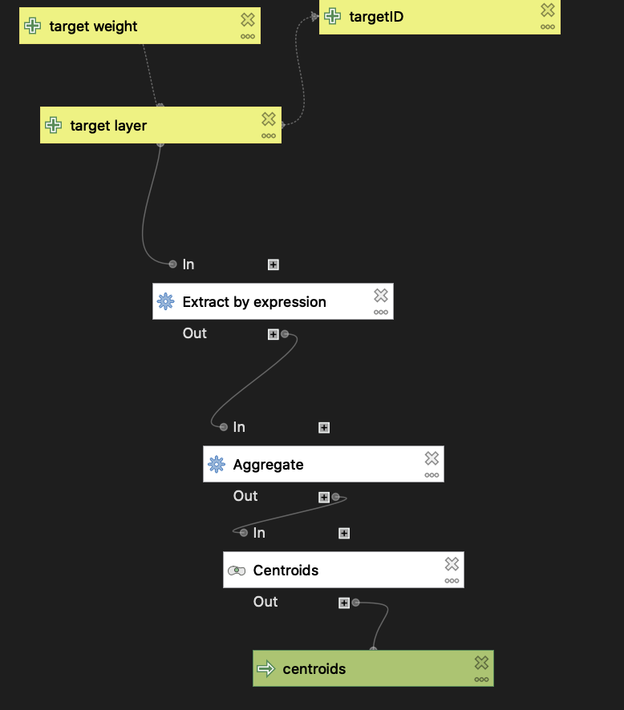
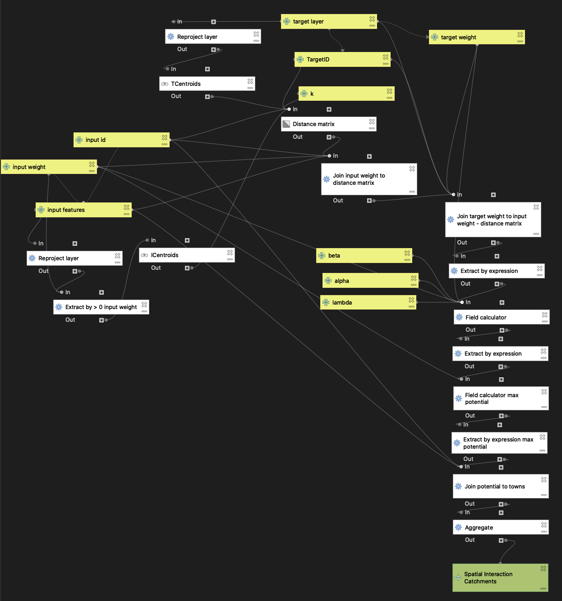

## Deliverables:
- [Web Map of Results](assets/index.html)
- [Gravity Model](assets/gravitymodel.model3)
- [Hospital Preprocessing Model](assets/preprocessing.model3)

## Purpose of the models:
A gravity model is an incredibly useful tool that can address issues of accessibility and distance between two objects. In this case, we are looking at the accessibility of hospitals within Vermont to analyze the service area of different hospitals in different towns throughout the state. Using two different input point layers, we can examine which hospitals serve which geographic areas. This model is able to automate a multi-step process that can involve many errors along the way. Through this model, the process of analyzing spatial interaction can be reproduce exactly the same each time.

Before the gravity model can be implemented, it is necessary to clean the data to ensure it can be used. This first model shows the preprocessing of one of the data set inputs used in the gravity model, hospitals. This model allows the data to cover the areas we are examining while also making sure we are looking at hospitals that serve the general population.

## Interpretation of the models:

## Acknowledgments:
Thank you to the Spring 2021 GEOG 323 class for all of the collaborative work and to Prof. Holler for data and guidance.

## Data sources:
- Hospital Data: [Homeland Security](https://hifld-geoplatform.opendata.arcgis.com/datasets/6ac5e325468c4cb9b905f1728d6fbf0f_0)
- [Dartmouth Atlas of Health Care boundary files](https://atlasdata.dartmouth.edu/downloads/supplemental#boundaries)
- Town Data: [American Community Survey 2018 5-year Average](netown.gpkg), complied by Prof. Holler.
