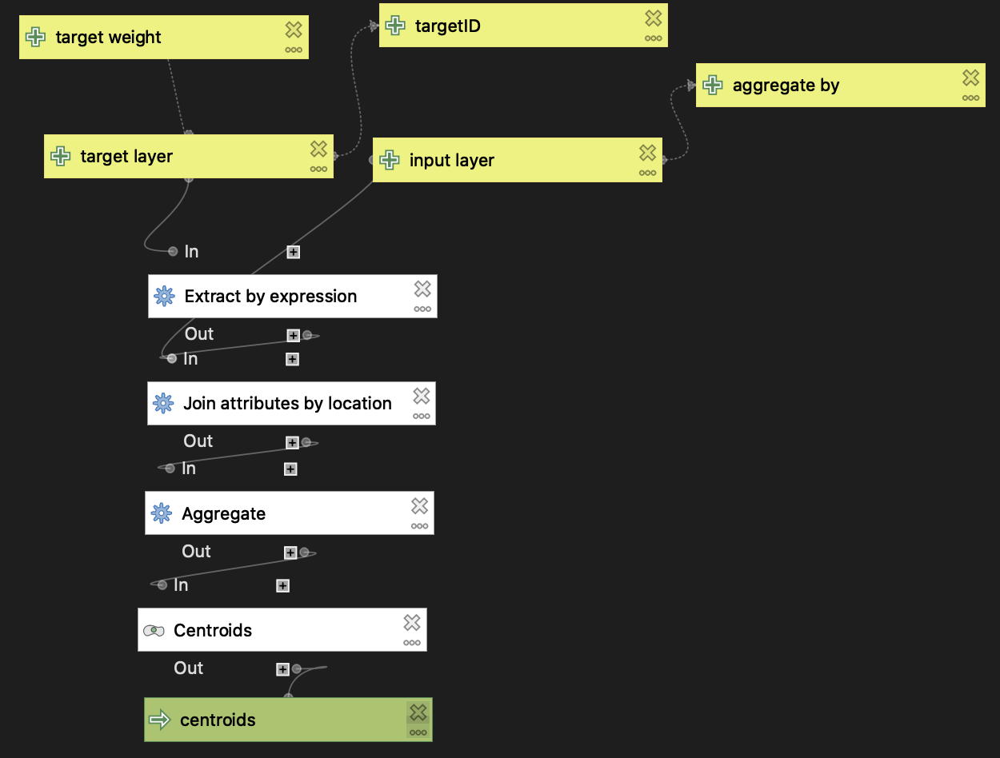
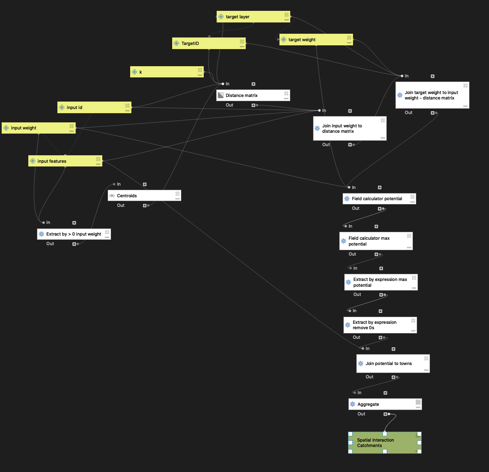

Deliverables:
- [Web Map of Results](assets/gravity)
- [Gravity Model](gravitymodel.model3)
- [Hospital Preprocessing Model](preprocessing.model3)

A gravity model is an incredibly useful tool that can address issues of accessibility and distance between two objects. In this case, we are looking at the accessibility of hospitals within Vermont to analyze the service area of different hospitals in different towns throughout the state.

